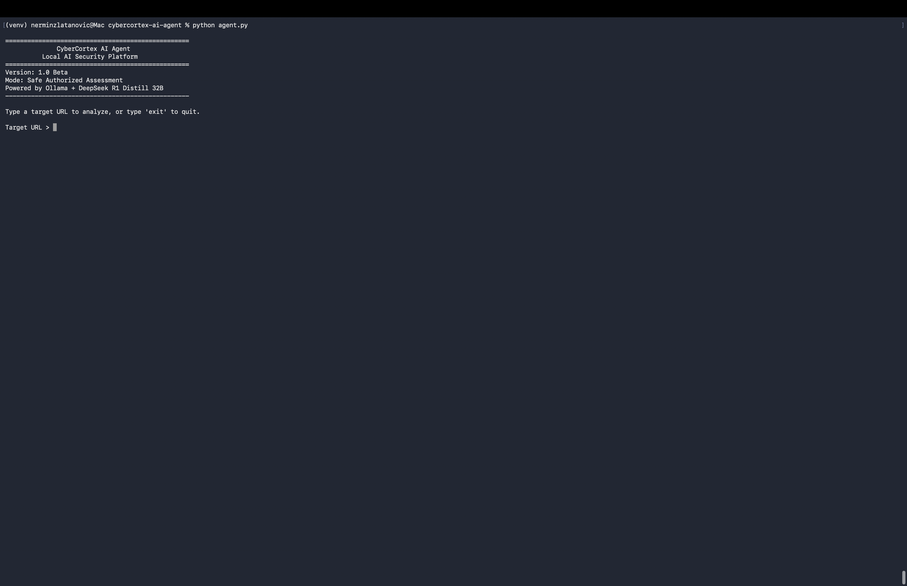
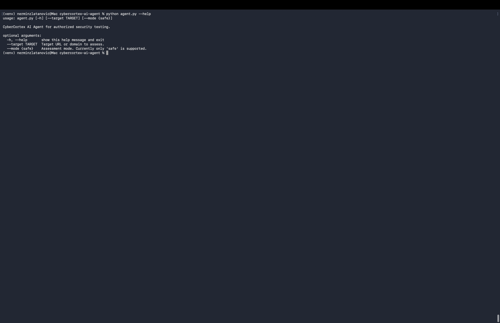
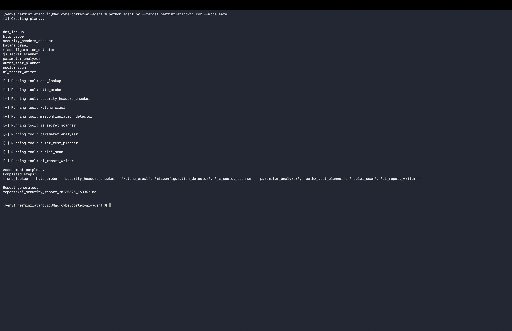
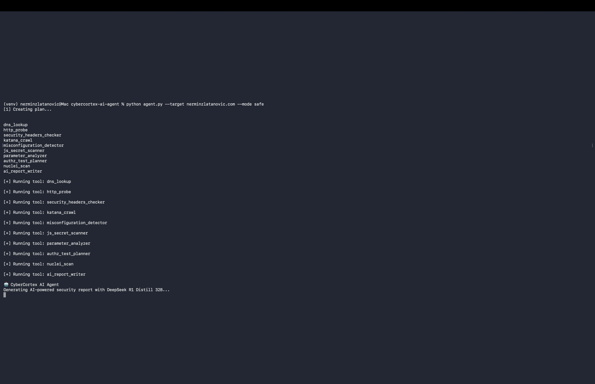
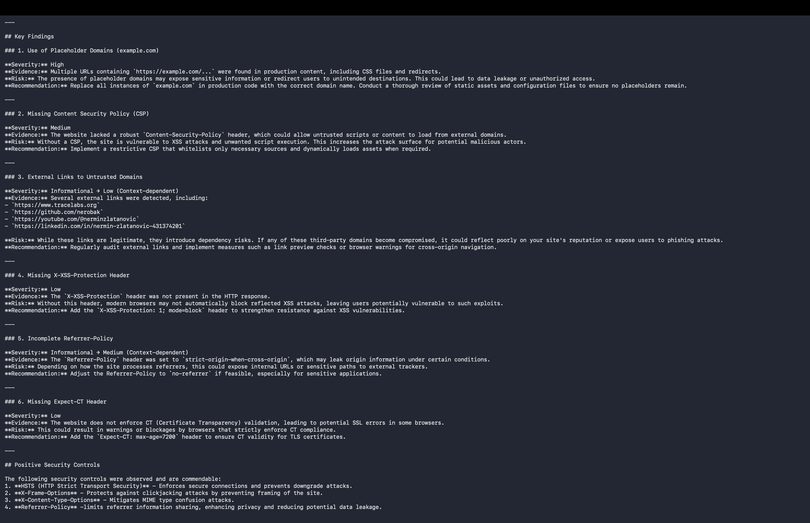
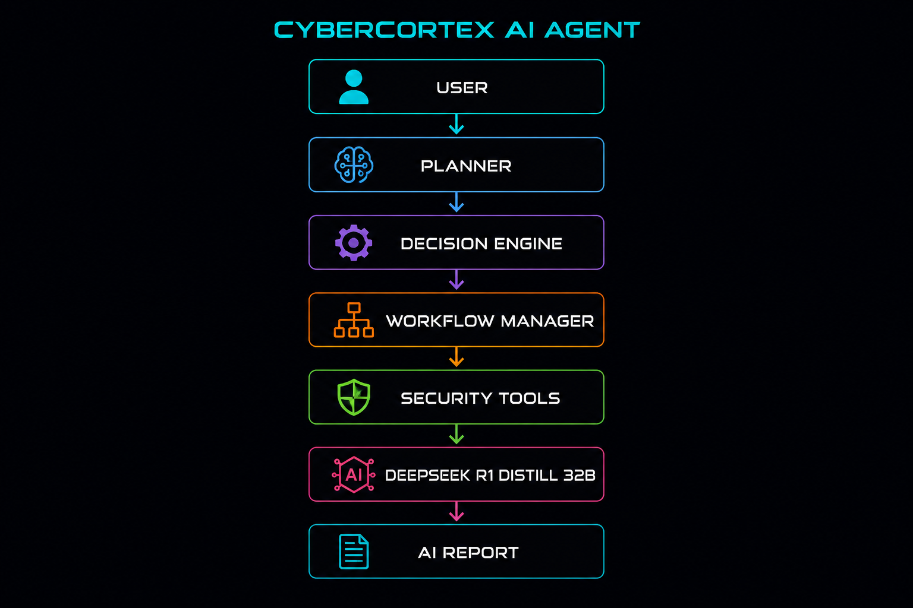

# CyberCortex AI Agent

> **A fully local AI-powered cybersecurity assistant for authorized security assessments, bug bounty research, reconnaissance, analysis, and professional reporting.**


---

## Overview

CyberCortex AI Agent is a fully local AI-powered cybersecurity platform designed to assist security professionals and bug bounty researchers during **authorized** security assessments.

Unlike traditional security automation scripts, CyberCortex AI Agent combines a local reasoning model (DeepSeek R1 Distill 32B running through Ollama) with custom-built cybersecurity tools to automate reconnaissance, analyze findings, prioritize manual testing, and generate professional security reports.

The project is designed around a modular AI architecture that separates planning, workflow management, decision-making, security tooling, and AI-assisted reporting.

No cloud AI services are required.

---
## Screenshots

### CyberCortex AI Agent



---

### Command-Line Interface



---

### Security Assessment Workflow



---

### Local DeepSeek Report Generation



---

### AI-Generated Security Report



---

### Architecture



# Features

## Local AI

* Fully local execution
* Ollama integration
* DeepSeek R1 Distill 32B
* No cloud-based LLM required

---

## AI Architecture

* AI Planner
* Decision Engine
* Workflow Manager
* Tool Registry
* Scope Guard
* AI Report Writer

---

## Security Tools

* DNS Lookup
* HTTP Probe
* Security Header Analysis
* Website Crawling (Katana)
* Misconfiguration Detection
* JavaScript Secret Scanner
* Parameter Analyzer
* Authorization Test Planner
* Nuclei Integration

---

## Reporting

* AI-generated Markdown reports
* Executive summaries
* Prioritized remediation guidance
* Manual verification recommendations

---

# Architecture

```text
                User
                  │
                  ▼
             agent.py
                  │
                  ▼
          Workflow Manager
                  │
                  ▼
              AI Planner
                  │
                  ▼
          Decision Engine
                  │
                  ▼
           Tool Registry
                  │
        ┌─────────┼─────────┐
        ▼         ▼         ▼
     Recon     Analysis   Reporting
        │
        ▼
 DeepSeek R1 Distill 32B
        │
        ▼
 Professional AI Report
```

---

# Installation

See:

**docs/INSTALL.md**

---

# Usage

Interactive Mode

```bash
python agent.py
```

CLI Mode

```bash
python agent.py --target https://example.com --mode safe
```

Help

```bash
python agent.py --help
```

---

# Project Structure

```text
cybercortex-ai-agent/

agent.py
config.py
tool_registry.py

agent_core/
tools/
tests/
reports/
docs/
examples/
logs/
archive/
```

---

# Documentation

* docs/INSTALL.md
* docs/ARCHITECTURE.md
* docs/TOOLS.md
* docs/ROADMAP.md

---

# Safety

CyberCortex AI Agent is designed **only** for authorized security testing.

Examples include:

* Systems you own
* Laboratory environments
* Capture-the-Flag (CTF) platforms
* Bug bounty programs that explicitly authorize testing

Targets outside the configured allowlist are blocked by the built-in Scope Guard.

---

# Roadmap

See:

**docs/ROADMAP.md**

Upcoming work includes:

* Assessment memory
* Historical comparison
* Plugin architecture
* Parallel execution
* Multi-agent collaboration
* Web dashboard
* REST API

---

# License

This project is released under the MIT License.

See the **LICENSE** file for details.

---

# Author

**Nermin Zlatanovic**

Founder of **CyberCortex**

Cybersecurity Specialist • AI Security Researcher • NIST NICE Ambassador

Website:

https://nerminzlatanovic.com

GitHub:

https://github.com/nerobak

---

## CyberCortex Vision

CyberCortex is a growing ecosystem of AI-powered cybersecurity projects focused on empowering defenders, researchers, and bug bounty hunters through local AI, automation, and practical security engineering.

CyberCortex AI Agent is the first major component of that ecosystem.

